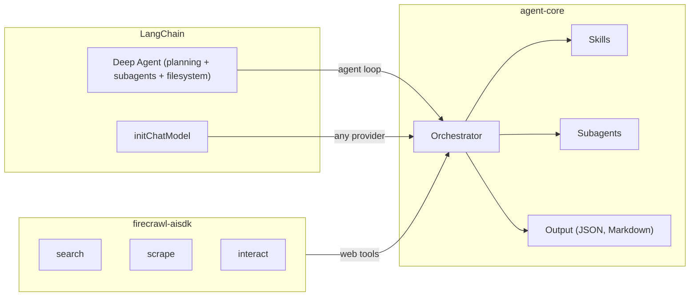

# Agent Core

The core agent logic. Built on [firecrawl-aisdk](https://www.npmjs.com/package/firecrawl-aisdk) for web tools and [LangChain's Deep Agents](https://github.com/langchain-ai/deepagentsjs) for the agent loop.

This is what all [templates](../agent-templates/) share. You can also use it directly as a library.

## Architecture



Agent-core combines [firecrawl-aisdk](https://www.npmjs.com/package/firecrawl-aisdk) (web tools) with LangChain's [`deepagents`](https://github.com/langchain-ai/deepagentsjs) (agent loop, planning, subagent dispatch, virtual filesystem) and `initChatModel` (universal provider adapter), and adds:

- **Skills** - SKILL.md files that teach the agent how to navigate specific sites, what to extract, and how to paginate. Auto-matched by URL via site playbooks. See `src/skills/definitions/` for built-in examples.
- **Subagents** - parallel agents spawned dynamically (`spawnAgents`) or pre-configured with their own model, instructions, and scoped tools/skills. Built on Deep Agents' `subagents` primitive.
- **Output** - `formatOutput` for structured JSON/markdown, `bashExec` — a set of bash tools powered by [just-bash](https://github.com/vercel-labs/just-bash) (jq, awk, sed, grep, and friends).
- **Context compaction** - automatic summarization when approaching token limits.

> Tools are defined once in the [Vercel AI SDK](https://sdk.vercel.ai/) `ToolSet` shape (so the same toolkit drops into either runtime) and wrapped with LangChain's `tool()` for Deep Agents.

## Quick start

**Via CLI** - scaffold a project that includes agent-core:

```bash
firecrawl create agent -t express
```

**As a library** - import directly:

```typescript
import { createAgent } from '@firecrawl/agent-core'

const agent = createAgent({
  firecrawlApiKey: 'fc-...',
  model: { provider: 'google', model: 'gemini-3-flash-preview' },
})

const result = await agent.run({ prompt: 'get pricing for Vercel' })
```

## API

### `createAgent(options)`

```typescript
createAgent({
  firecrawlApiKey: string,          // required
  model: ModelConfig,                // { provider, model }
  subAgentModel?: ModelConfig,       // for parallel workers (defaults to model)
  apiKeys?: Record<string, string>,  // { google: '...', anthropic: '...', openai: '...' }
  skillsDir?: string,                // path to custom skills
  maxSteps?: number,                 // max agent steps (default: 50)
  maxWorkers?: number,               // max parallel workers (default: 6)
  workerMaxSteps?: number,           // max steps per worker (default: 10)
})
```

### `agent.run(params)`

Run to completion:

```typescript
const result = await agent.run({
  prompt: string,                    // the research task (required)
  urls?: string[],                   // seed URLs
  schema?: object,                   // example/shape object, NOT JSON Schema (see note below)
  format?: 'json' | 'markdown',
  skills?: string[],                 // skills to pre-load
  skillInstructions?: Record<string, string>,  // per-skill custom instructions
  subAgents?: SubAgentConfig[],      // custom subagents for this run
  maxSteps?: number,                 // override per-run
  exportSkill?: boolean,             // generate reusable skill from the run
})
```

> **`schema` is an example/shape object, not JSON Schema.** Pass the shape of
> the data you want back — keys are the fields, values are placeholders
> (`''`, `null`, `0`). Arrays mean "a list of this shape" (the first item is the
> template). The schema gate checks that every leaf key is present and non-empty.
>
> ```typescript
> // ✅ shape object
> schema: { ceo: '', foundedYear: 0, sourceUrl: '' }
> schema: { tiers: [{ name: '', price: '' }] }   // list of objects
>
> // ❌ NOT JSON Schema — its keys (type/properties/required) get read as data fields
> schema: { type: 'object', properties: { ceo: { type: 'string' } }, required: ['ceo'] }
> ```

#### Subagents

Define specialized subagents with their own instructions, tools, skills, and step limits:

```typescript
const result = await agent.run({
  prompt: 'Build a competitive analysis of Vercel, Netlify, and Cloudflare Pages',
  subAgents: [
    {
      id: 'pricing_analyst',
      name: 'Pricing Analyst',
      description: 'Extract and compare pricing tiers across platforms',
      instructions: 'Focus exclusively on pricing data. Extract every tier, its price, and included limits. Ignore marketing copy.',
      model: { provider: 'anthropic', model: 'claude-sonnet-4-20250514' },
      tools: ['scrape'],
      skills: ['pricing-tracker'],
      maxSteps: 20,
    },
    {
      id: 'feature_reviewer',
      name: 'Feature Reviewer',
      description: 'Catalog features and developer experience across platforms',
      instructions: 'Look at docs and changelog, not just marketing pages. Note what each platform does that the others do not.',
      model: { provider: 'google', model: 'gemini-3-flash-preview' },
      tools: ['search', 'scrape'],
      skills: ['deep-research'],
      maxSteps: 15,
    },
  ],
  format: 'json',
})
```

```typescript
// E-commerce: one agent per retailer, each with site-specific instructions
const result = await agent.run({
  prompt: 'Find the best price for a Sony WH-1000XM5 across major retailers',
  subAgents: [
    {
      id: 'amazon',
      name: 'Amazon Scraper',
      description: 'Check Amazon product listing and price',
      instructions: 'Navigate to the product page directly. Extract current price, Prime price if different, and any active coupons.',
      model: { provider: 'google', model: 'gemini-3-flash-preview' },
      tools: ['search', 'scrape', 'interact'],
      skills: ['e-commerce'],
      maxSteps: 8,
    },
    {
      id: 'bestbuy',
      name: 'Best Buy Scraper',
      description: 'Check Best Buy product listing and price',
      instructions: 'Check both the regular price and any open-box/renewed options. Note member pricing if visible.',
      model: { provider: 'google', model: 'gemini-3-flash-preview' },
      tools: ['search', 'scrape'],
      skills: ['e-commerce'],
      maxSteps: 8,
    },
  ],
})
```

```typescript
// Financial research: give each agent a different data source
const result = await agent.run({
  prompt: 'Get a complete financial overview of NVIDIA',
  subAgents: [
    {
      id: 'sec_filings',
      name: 'SEC Filing Analyst',
      description: 'Pull key metrics from latest 10-K and 10-Q',
      instructions: 'Go to SEC EDGAR directly. Extract revenue, net income, EPS, and guidance from the most recent quarterly filing.',
      model: { provider: 'anthropic', model: 'claude-sonnet-4-20250514' },
      tools: ['search', 'scrape'],
      skills: ['financial-research'],
      maxSteps: 12,
    },
    {
      id: 'analyst_consensus',
      name: 'Analyst Consensus Tracker',
      description: 'Gather analyst ratings and price targets',
      instructions: 'Check Yahoo Finance and TipRanks. Get the consensus rating, average price target, and range.',
      model: { provider: 'google', model: 'gemini-3-flash-preview' },
      tools: ['search', 'scrape'],
      skills: ['financial-research'],
      maxSteps: 10,
    },
  ],
  schema: {
    ticker: 'NVDA',
    revenue: null,
    netIncome: null,
    eps: null,
    analystRating: null,
    priceTarget: { average: null, low: null, high: null },
    sources: [],
  },
  format: 'json',
})
```

#### Skill instructions

Override or augment skill behavior per-run without editing the skill files:

```typescript
// Tell the deep-research skill to only use specific sources
const result = await agent.run({
  prompt: 'Research the environmental impact of lithium mining',
  skills: ['deep-research'],
  skillInstructions: {
    'deep-research': 'Only use peer-reviewed sources: Google Scholar, PubMed, Nature, Science Direct. Ignore news articles and blog posts.',
  },
})
```

```typescript
// Customize e-commerce extraction for a specific use case
const result = await agent.run({
  prompt: 'Get all running shoes under $150 from Nike.com',
  urls: ['https://www.nike.com/w/running-shoes'],
  skills: ['e-commerce'],
  skillInstructions: {
    'e-commerce': 'Only extract shoes priced under $150. Include colorways available. Skip kids sizes.',
  },
})
```

#### Export skill

Turn any run into a reusable skill:

```typescript
// Run a task and export it as a repeatable workflow
const result = await agent.run({
  prompt: 'Get the top 10 trending repositories on GitHub',
  urls: ['https://github.com/trending'],
  exportSkill: true,
})

// result.exportedSkill contains:
// - name: 'github-trending'
// - skillMd: full SKILL.md with self-healing instructions
// - workflow: deterministic Node.js script using @mendable/firecrawl-js
// - schema: JSON schema for validating the output
console.log(result.exportedSkill.name)      // 'github-trending'
console.log(result.exportedSkill.workflow)   // #!/usr/bin/env node ...
```

```typescript
// Export a complex multi-step workflow as a skill, then save it
const result = await agent.run({
  prompt: 'Get YC batch W25 companies with their funding and team size from HN and Crunchbase',
  exportSkill: true,
  format: 'json',
  schema: {
    companies: [{ name: '', url: '', funding: '', teamSize: null, sources: [] }],
  },
})

// Save the exported skill to your skills directory
if (result.exportedSkill) {
  const dir = `./skills/${result.exportedSkill.name}`
  fs.mkdirSync(dir, { recursive: true })
  fs.writeFileSync(`${dir}/SKILL.md`, result.exportedSkill.skillMd)
  fs.writeFileSync(`${dir}/workflow.mjs`, result.exportedSkill.workflow)
  fs.writeFileSync(`${dir}/schema.json`, result.exportedSkill.schema)
}
// Next time: agent.run({ prompt: '...', skills: ['yc-w25-companies'] })
```

```typescript
// Monitor a page on a schedule - export once, run the script directly after
const result = await agent.run({
  prompt: 'Track the price of RTX 5090 on Newegg, Best Buy, and Amazon',
  exportSkill: true,
})

// The workflow.mjs can now run standalone without the agent:
// FIRECRAWL_API_KEY=fc-... node workflow.mjs
// Exit 0 = data collected, exit 1 = partial, exit 2 = stale URLs (re-run agent)
```

### `agent.stream(params)`

Stream events as they happen:

```typescript
for await (const event of agent.stream({ prompt: '...' })) {
  if (event.type === 'text') process.stdout.write(event.content)
}
```

### `agent.plan(prompt)`

Plan without executing:

```typescript
const plan = await agent.plan('compare pricing across 5 CDN providers')
```

## Providers

| Provider | Config |
|----------|--------|
| Google Gemini | `{ provider: 'google', model: 'gemini-3-flash-preview' }` |
| Google Gemini (Pro) | `{ provider: 'google', model: 'gemini-3.1-pro-preview' }` |
| Anthropic Claude | `{ provider: 'anthropic', model: 'claude-sonnet-4-6' }` |
| OpenAI | `{ provider: 'openai', model: 'gpt-5.4' }` |
| Custom (OpenAI-compat) | `{ provider: 'custom-openai', model: 'your-model', baseURL: '...' }` |

Set API keys via `apiKeys` option or environment variables (`GOOGLE_GENERATIVE_AI_API_KEY`, `ANTHROPIC_API_KEY`, `OPENAI_API_KEY`).

## OpenAPI spec

[`openapi.yaml`](./openapi.yaml) describes the HTTP API. All [templates](../agent-templates/) implement it.

### API examples

All features available in the library are also available via the HTTP API:

**Subagents via API:**

```bash
curl -X POST http://localhost:3000/v1/run \
  -H 'Content-Type: application/json' \
  -d '{
    "prompt": "Compare Vercel and Netlify pricing",
    "subAgents": [
      {
        "id": "vercel",
        "name": "Vercel Researcher",
        "description": "Extract Vercel pricing tiers",
        "instructions": "Go directly to vercel.com/pricing. Extract every tier with price and limits.",
        "tools": ["scrape"],
        "skills": ["pricing-tracker"],
        "maxSteps": 12
      },
      {
        "id": "netlify",
        "name": "Netlify Researcher",
        "description": "Extract Netlify pricing tiers",
        "instructions": "Go directly to netlify.com/pricing. Extract every tier with price and limits.",
        "tools": ["scrape"],
        "skills": ["pricing-tracker"],
        "maxSteps": 12
      }
    ],
    "format": "json"
  }'
```

**Export skill via API:**

```bash
curl -X POST http://localhost:3000/v1/run \
  -H 'Content-Type: application/json' \
  -d '{
    "prompt": "Get the top Show HN posts from Hacker News",
    "urls": ["https://news.ycombinator.com/show"],
    "exportSkill": true
  }'

# Response includes exportedSkill with name, skillMd, workflow, and schema
```

**Skill instructions via API:**

```bash
curl -X POST http://localhost:3000/v1/run \
  -H 'Content-Type: application/json' \
  -d '{
    "prompt": "Research LLM pricing across providers",
    "skills": ["deep-research"],
    "skillInstructions": {
      "deep-research": "Only use official pricing pages. No blog posts or third-party comparisons."
    },
    "format": "json"
  }'
```

## Files

| File | Purpose |
|------|---------|
| `src/agent.ts` | `createAgent()` public API |
| `src/orchestrator/` | Agent setup, tool wiring, prompt loading |
| `src/worker/` | Parallel worker execution |
| `src/skills/` | Skill discovery, parsing, tools |
| `src/toolkit.ts` | Firecrawl SDK integration |
| `src/tools.ts` | formatOutput + bashExec |
| `src/resolve-model.ts` | Multi-provider model resolution |
| `src/types.ts` | TypeScript types |
| `openapi.yaml` | HTTP API specification |

## Troubleshooting

### `Unknown name "const"` error with Gemini

If you see a 400 error mentioning `Unknown name "const"` from Google, the Gemini API is rejecting a tool schema that uses the JSON Schema `const` keyword (which the `scrape` tool's schema contains). Switch to another provider for this run, or set a stable model ID via `MODEL=anthropic:claude-sonnet-4-6`.

### `@langchain/google` / `@langchain/openai` not found at runtime

The LangChain provider packages are optional peer deps — Deep Agents imports them lazily based on which provider you use. Install the one you need:

```bash
npm i @langchain/google @langchain/google-genai   # for google provider
npm i @langchain/openai                            # for openai / custom-openai
npm i @langchain/anthropic                         # for anthropic
```

### "prompt is required"

`run()`, `stream()`, and `plan()` all reject empty or whitespace-only prompts. Pass a non-empty string.

### Missing API key

`createAgentFromEnv()` throws a clear error when the selected provider's API key isn't set:

```
ANTHROPIC_API_KEY not set (required for provider "anthropic").
Set it in your .env file or switch providers via MODEL_PROVIDER.
```

Run `npm run doctor` in the templates for a fuller preflight check.
